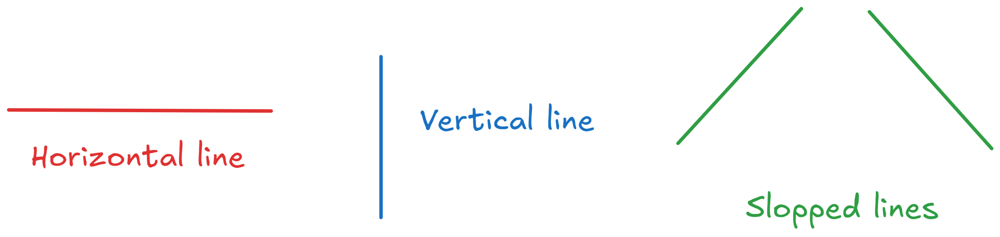
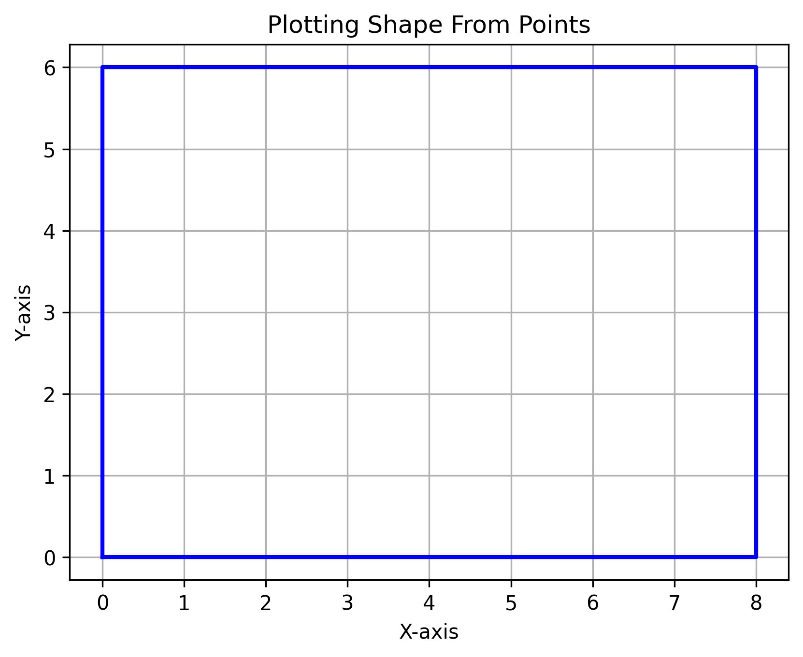
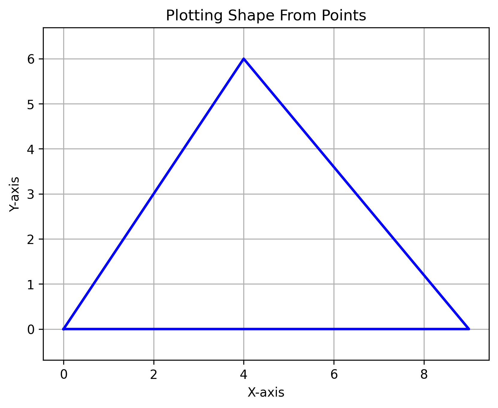

# Boundary Mapping Challenge

## Introduction

A field worker is meant to walk around the boundary of an area. They are walking with a device that is able to get their coordinates as they walk. You are meant to get the shape of the area from these coordinates.

The code in this repo simulates how to process the GPS data returned by the worker walking around the border of the farm. The points in the points list show the GPS points returned by the worker. These points are then processed to get the lines of the shape, the edges of the shape and then plots the shape. This code is meant to show a possible algorithm that could be implemented on Android devices, allowing a device to compute shape of path walked while offline using its GPS that will return coordinates periodically.

The algorithm used assumes that the shape of the border is made up of either horizontal lines, vertical lines or slopped lines. These lines are shown below:


These types of lines are implemented in the code in the **VerticalLine**, **HorizontalLine** and **SlantedLine** classes. Any shape that is made up of the lines above can be processed by the code in this repo.

From the edges of the shape, other activities like getting if a point is inside of the shape can be done.

## Algorithm for getting lines from points

As the algorithm gets new points that are part of the border of the shape, it checks if the point is part of the current line of the shape. If so the point is added to the line otherwise a new line is created.

We are able to know that a point is in the line using the equation of the line. If the line is a vertical line i.e. x = value we will know that a point (x, y) is in that line if its x coordinate makes the equation of the vertical line true. If the line is horizontal i.e. y = value we will know that a point (x, y) is in that line if its y coordinate makes the equation true. For a slopped line, we will use the point slope formual i.e. y1 - y = m(x - x1) to determine if a point (x1, y1) is in the line. The slope m of the line is calculated from the points that make up the slopped line. We then check if point (x1, y1) makes the equation above true with one of the points (x, y) that are in the slopped line.

The code for doing these checks are in the *mapper.py* file.

The implemented algorithm looks like this:

1. Store lines in shape
2. For each point walked
3. If shape has no stored lines construct first line
4. Else check if new point is part of the current line
5. If point is part of current line update line's end point to new point
6. Else create a new line that begins from the end of current line and ends at new point

## How To Run Code

To run the code do the following:
1. Create a list of **Point** with each point that the field worker passed through
2. Pass this list of points to the **plot_shape** function
3. Call the plot_shape function. The plotted shape will be stored in a *shape.png* file

## Examples

### A rectangular shape

Running the code with the following points will give you this output:

```python
points = [Point(x=0, y=0), Point(x=0, y=3), Point(x=0, y=6), Point(x=4, y=6), Point(x=8, y=6), Point(x=8, y=3), Point(x=8, y=0), Point(x=4, y=0), Point(x=0, y=0)]
plot_shape(points=points)
```


### A triangle shape

Running the code with the following points will give you this output:

```python
points = [Point(x=0, y=0), Point(x=2, y=3), Point(x=4, y=6), Point(x=6.5, y=3), Point(x=9, y=0), Point(x=5, y=0), Point(x=0, y=0)]
plot_shape(points=points)
```

